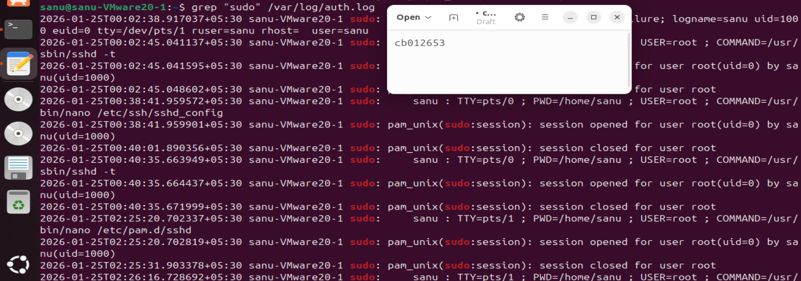

<div align="center">

# Cyber Security Lab Work

### Hands-on offensive security practicals documented from a controlled Ubuntu lab.

A collection of four practical phases covering web application exploitation, cryptography, privilege escalation, network exploitation and forensic analysis.

[**Repository**](https://github.com/T0T0R0-byte/cybersecurity-lab-work)


</div>

---

## Overview

This repository contains practical security work performed against an Ubuntu virtual machine built for coursework.

The lab was deliberately configured with weaknesses, then assessed through controlled attack phases. Each phase records the setup, commands, observed behaviour and supporting evidence.

The work stays inside the lab environment. No third-party systems are targeted.

## Practical Phases

| Phase | Focus | Evidence |
| --- | --- | --- |
| **01** | Web Application Exploitation | Request/response evidence, vulnerable services and exploitation steps |
| **02** | Cryptography | Challenge evidence covering the assigned cryptographic tasks |
| **03** | Privilege Escalation | Sudo misconfiguration, SUID abuse and root-level access |
| **04 & 05** | Network Exploitation + Forensics | Service enumeration, FTP exploitation, log analysis and evidence recovery |

## Evidence Gallery

The repository contains the full evidence set inside `docs/evidence/`. A few representative captures are shown below.

<table>
<tr>
<td width="50%">

### Web Exploitation



</td>
<td width="50%">

### Privilege Escalation


</td>
</tr>
<tr>
<td width="50%">

### Network Exploitation


</td>
<td width="50%">

### Forensic Analysis


</td>
</tr>
</table>

## Write-ups

| Document | Coverage |
| --- | --- |
| [Phase 1: Web Application Exploitation](docs/01-web-application-exploitation.md) | Web server setup, vulnerable application work and exploitation evidence |
| [Phase 2: Cryptography](docs/02-cryptography.md) | Assigned cryptography challenges and captured evidence |
| [Phase 3: Privilege Escalation](docs/03-privilege-escalation.md) | Sudo abuse and insecure SUID binary escalation |
| [Phase 4 and 5: Network Exploitation and Forensics](docs/04-network-and-forensics.md) | Enumeration, FTP exploitation and forensic investigation |

## Lab Environment

- Ubuntu Server virtual machine
- Host-only lab networking
- Apache2, MariaDB, PHP and vsftpd
- SSH and FTP services
- Kali Linux attacker environment
- Command-line tooling for enumeration, exploitation and investigation

The environment was built specifically for the practical work and is no longer an active target.

## What I Practised

- Web application enumeration and exploitation
- Cryptographic challenge solving
- Linux privilege escalation
- Service and network enumeration
- FTP misconfiguration exploitation
- Authentication-log investigation
- Shell history and filesystem analysis
- Evidence-driven technical reporting

## Repository Structure

```text
.
├── docs/
│   ├── 01-web-application-exploitation.md
│   ├── 02-cryptography.md
│   ├── 03-privilege-escalation.md
│   ├── 04-network-and-forensics.md
│   └── evidence/
│       ├── 01-web-application-exploitation/
│       ├── 02-cryptography/
│       ├── 03-privilege-escalation/
│       └── 04-network-and-forensics/
├── .gitignore
├── LICENSE
└── README.md
```

## Scope

This is coursework performed in a deliberately vulnerable environment owned and configured for the exercise. The evidence and techniques are intended for authorised lab use and security education.

<div align="center">

**Faraj Farook · CB012653**

</div>
