# Phase 1: Web Application Exploitation

Building and exploiting a vulnerable web application on the lab box, with the request/response evidence captured at each step.

---

<!-- source: phase 1 done web application exploitation.docx -->

1. System Overview3

1. Creating the CTF Box4

Phase 1 – Web Application Exploitation4

Phase 2 – Cryptography25

Phase 3 – Privilege Escalation40

Phase 4: Network Exploitation60

Phase 5: Forensics68

3. Risk & Threat Analysis72

4. Incident Response & Recovery73

5. Critical Reflection73

# 1. System Overview

The Capture The Flag (CTF) environment was designed to simulate a realistic vulnerable server hosted within an internal network. The system was built on a Linux-based architecture, integrating standard web services with deliberate misconfigurations to create a multi-layered challenge.

Base Operating System: Ubuntu Linux (Server Edition)

Network Configuration:

IP Address: 192.168.221.138 (Static/DHCP)

Network Mode: Host-Only / NAT (Accessible to Attacker VM)

Services & Tools installed:

Web Server: Apache2 (Port 80, 9876) running PHP and MariaDB.

File Transfer: vsftpd (Port 21).

Remote Access: OpenSSH (Port 22).

System Utilities: Python3, OpenSSL, GCC, Nano.

Google Drive: link

# 1. Creating the CTF Box

## Phase 1 – Web Application Exploitation

Environment Setup

The CTF environment was built on Ubuntu Server using a standard LAMP stack (Linux, Apache, MariaDB, PHP) to simulate a realistic corporate web server.

Step 1: System Update & Upgrade

I began by ensuring the system repositories were up to date and all existing packages were upgraded to their latest versions in a single pass.

Command: sudo apt update && sudo apt upgrade -y

Evidence:

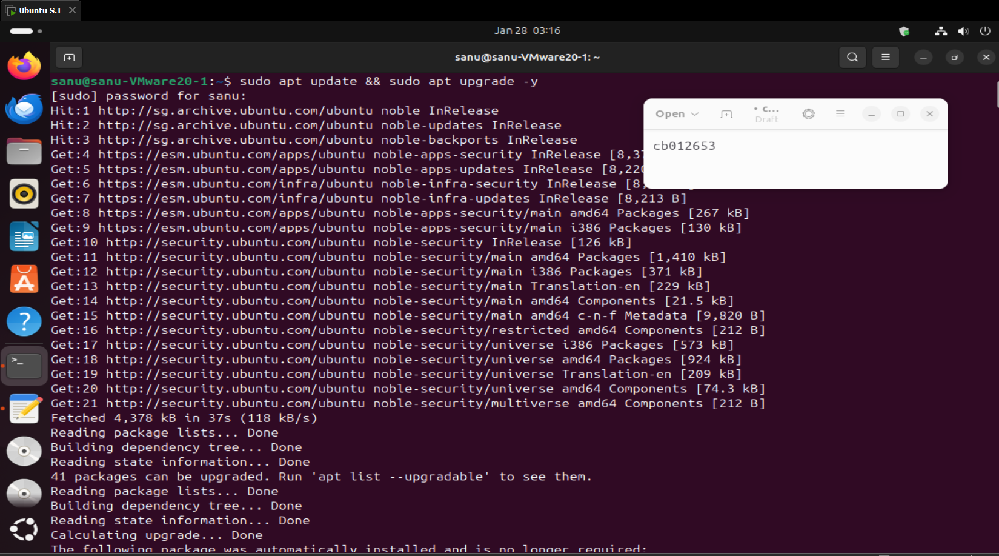
Figure 1.1: Updating and upgrading the Ubuntu system packages.

Step 2: Installing the LAMP Stack

I installed the core services required to host the vulnerable application: Apache2 (Web Server), MariaDB (Database), and PHP.

Command: sudo apt install -y apache2 mariadb-server php php-mysql

Evidence:

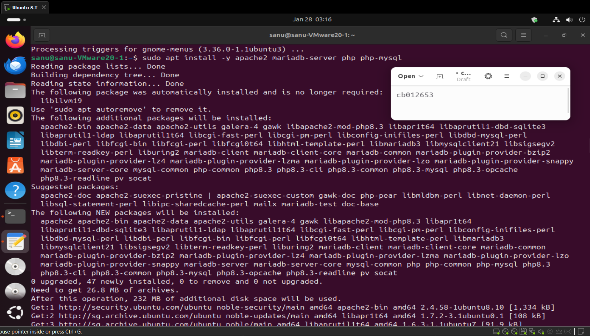
Figure 1.2: Installation of the web server and database components.

Step 3: Service Configuration

To ensure persistence, I enabled the services to start on boot and immediately started them.

Commands:

sudo systemctl enable apache2

sudo systemctl enable mariadb

sudo systemctl start apache2

sudo systemctl start mariadb

Evidence:

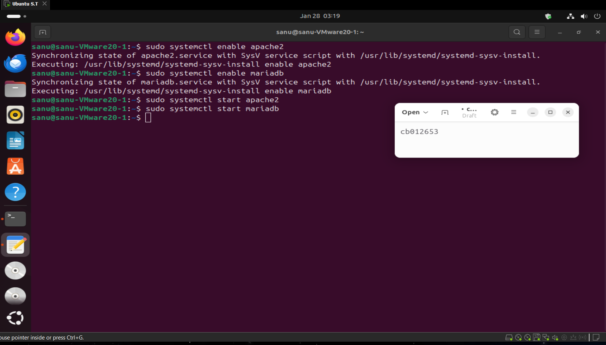
Figure 1.3: Configuring system services for persistence.

Step 4: Verifying Web Server

I verified the Apache service status to ensure it was active and running without errors.

Command: sudo systemctl status apache2

Evidence:

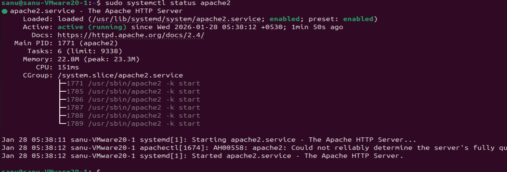
Figure 1.4: Verifying the active status of the Apache web server.

Step 5: Localhost Connectivity

I accessed http://localhost to confirm the web server was reachable and serving content.

Evidence:

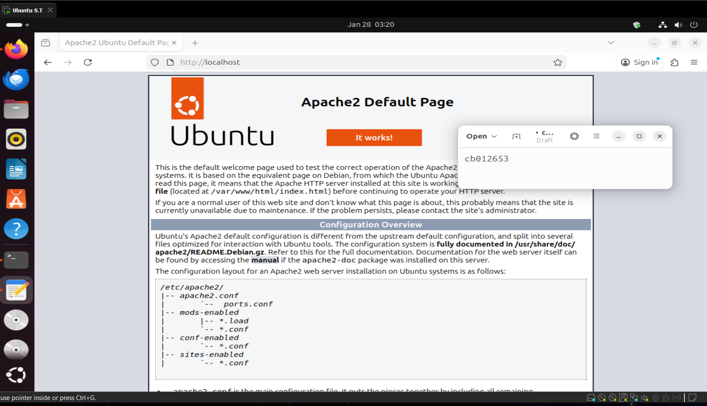
Figure 1.5: Confirmation of web server reachability via HTTP.

Step 6: Database Security

I ran the mysql_secure_installation script to remove anonymous users and disable remote root login, simulating a semi-secured production database.

Command: sudo mysql_secure_installation

Evidence:

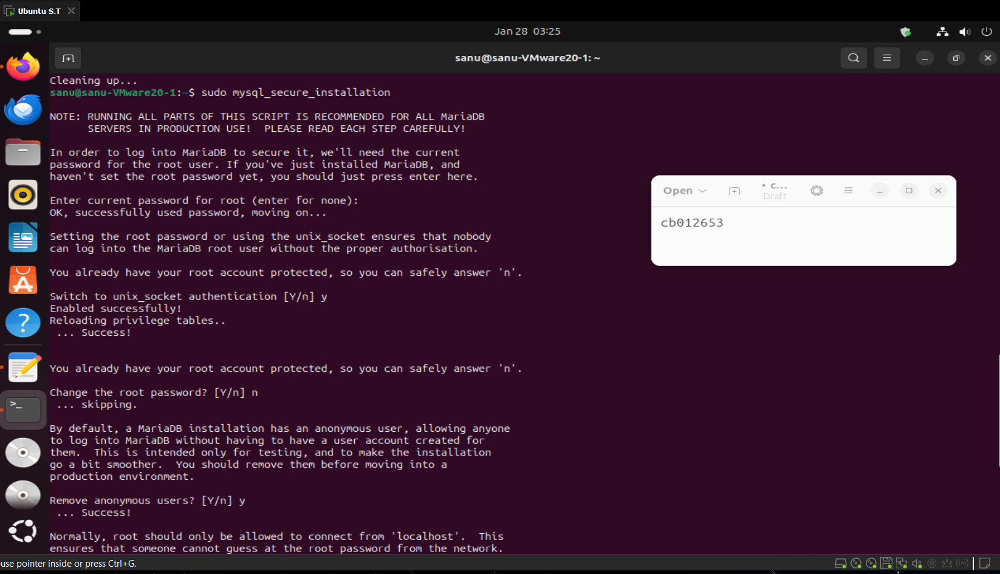
Figure 1.6: Hardening the database installation.

1.1.2 Database Design & Flag Placement

I used MariaDB to design the backend for the challenge. This involved creating a specific database (logistics_portal) and seeding it with user credentials and the hidden flag.

Step 7: Database Access

I logged into the MariaDB console to initialize the backend data.

Command: sudo mysql -u root -p

Evidence:

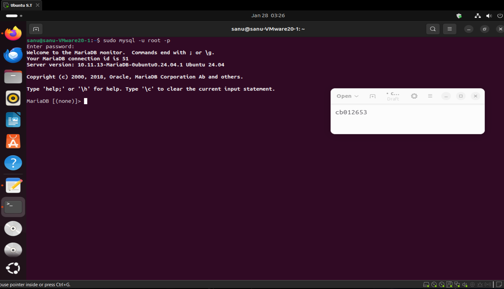
Figure 1.7: Accessing the MariaDB console.

Step 8: Schema & Flag Setup

I created the logistics_portal database and two tables: users (for the SQLi challenge) and incident_reports (for the flag).

SQL Commands:

CREATE DATABASE logistics_portal;

USE logistics_portal;

CREATE TABLE users...

CREATE TABLE incident_reports...

INSERT INTO incident_reports VALUES (..., 'FLAG{PHASE1_SQLI_INTERNAL_BREACH}');

Evidence:

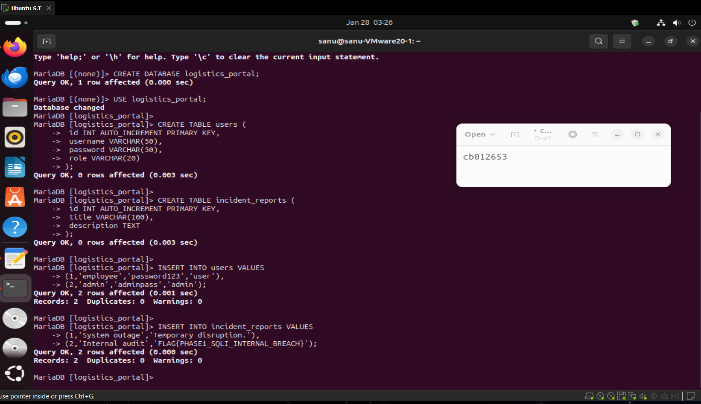
Figure 1.8: Defining the database schema and seeding the hidden flag.

1.1.3 Challenge 1: Vulnerable Login Portal

I created a directory for the login portal and assigned the correct permissions to the web user (www-data).

Step 9: Directory Structure

Command: sudo mkdir -p /var/www/html/portal

Evidence:

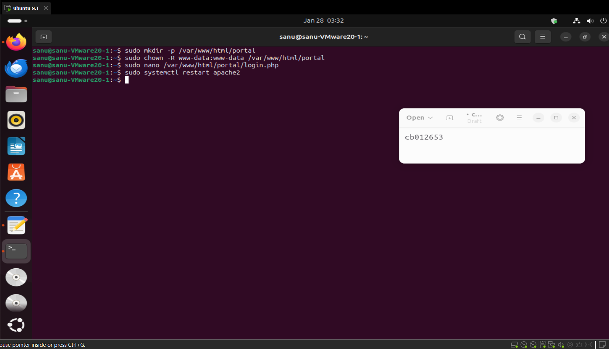
Figure 1.9: Creating the web directory for the portal.

Step 10: Vulnerable Code Implementation

I created login.php, intentionally introducing an SQL Injection vulnerability by concatenating user input directly into the query string.

Command: sudo nano /var/www/html/portal/login.php

Evidence:

Figure 1.10: Developing the vulnerable login script.

Step 11: Code Review (Vulnerability)

The specific line $sql = "SELECT * FROM staff WHERE username='$u'..." demonstrates the lack of input sanitization.

Evidence:

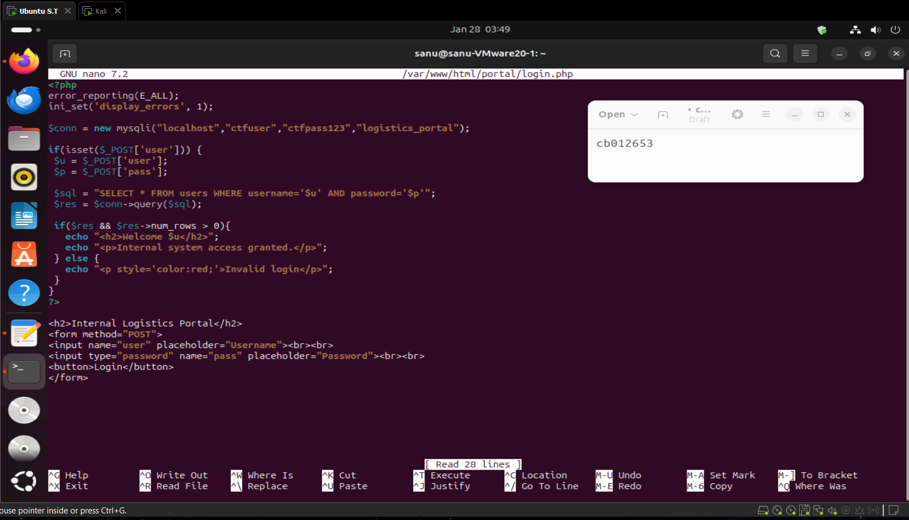
Figure 1.11: Detail of the unsanitized SQL query construction.

Step 12: Permission Management

I assigned ownership of the portal files to the www-data user.

Command: sudo chown -R www-data:www-data /var/www/html/portal

Evidence:

Figure 1.12: Setting file ownership permissions.

Step 13: Functional Test

I verified the login page rendered correctly in the browser.

Evidence:

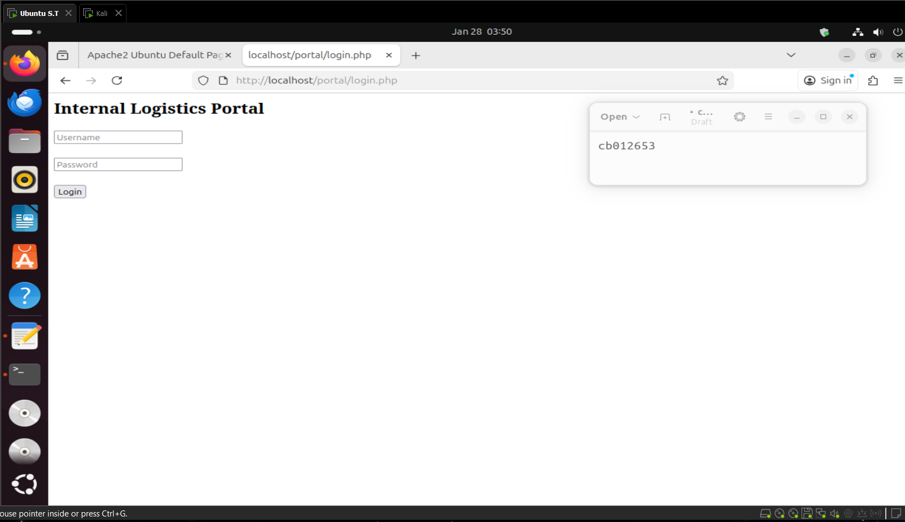
Figure 1.13: The live Employee Portal login interface.

1.1.4 Challenge 2: Vulnerable Reporting System

I created a secondary system for "Incident Reporting" which contains a Stored XSS vulnerability.

Step 14: Reports Directory

Command: sudo mkdir -p /var/www/html/reports

Evidence:

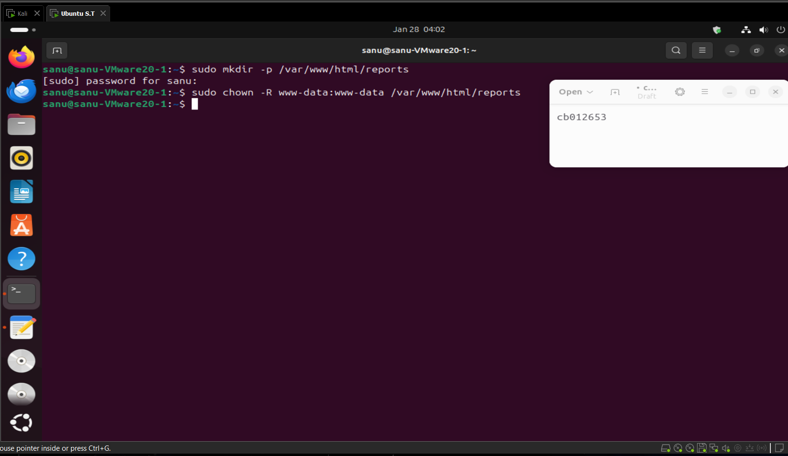
Figure 1.14: Creating the directory for the XSS challenge.

Step 15: Permission Management (Reports)

Command: sudo chown -R www-data:www-data /var/www/html/reports

Evidence:

Figure 1.15: Setting permissions for the reports directory.

Step 16: Vulnerable Submission Page

I created index.php, which handles ticket submission (INSERT) without sanitizing the input.

Command: sudo nano /var/www/html/reports/index.php

Evidence:

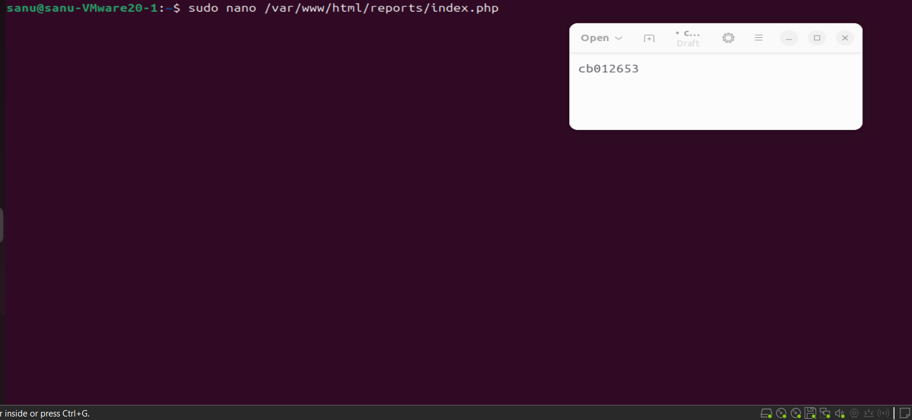
Figure 1.16: Developing the incident submission page.

Step 17: Vulnerable Admin Dashboard

I created admin.php, which handles ticket display (SELECT) and contains the vulnerability.

Command: sudo nano /var/www/html/reports/admin.php

Evidence:

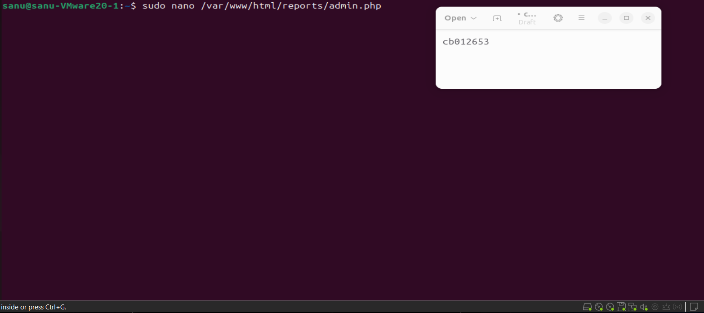
Figure 1.17: Developing the vulnerable admin dashboard.

Step 18: Flag Logic

The script echoes ticket content without htmlspecialchars(). I also embedded a hidden input field containing the flag FLAG{web-02-stored_xss_success}.

Evidence:

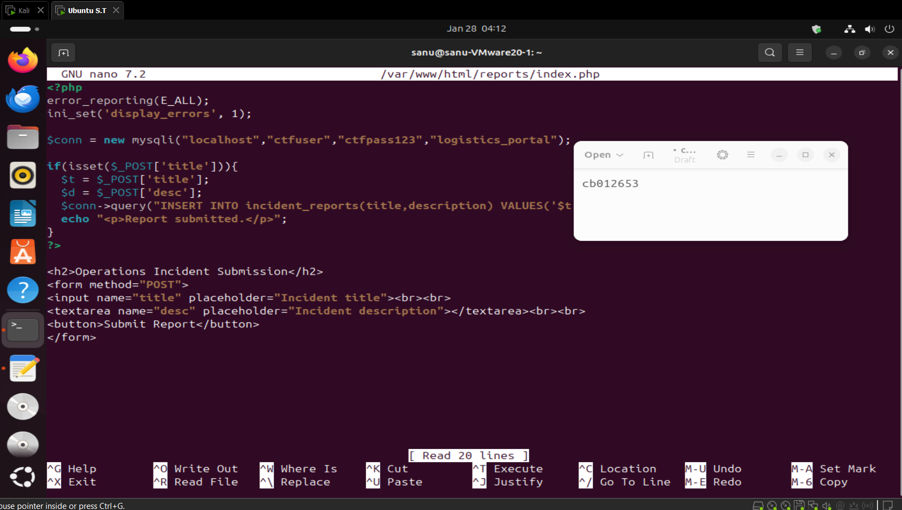
Figure 1.18: Code detail showing the lack of output encoding and the hidden flag.

Phase 1 – Web Application Exploitation

Pre-Engagement: Network Discovery

Before launching attacks, I verified the target IP address from the Kali Linux attacker machine.

Commands:

ip a

ping 192.168.221.139

Evidence:

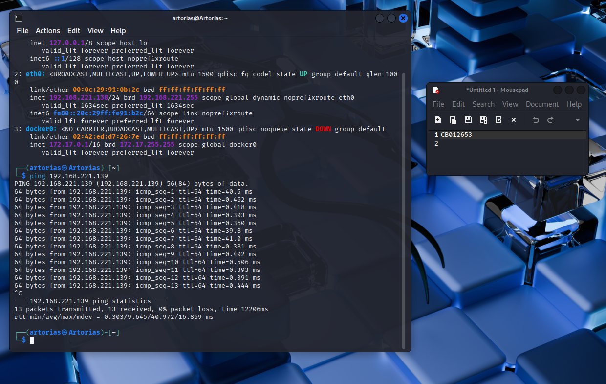
Figure 2.1: Confirming connectivity between Kali Linux and the Target VM.

Exploitation 1: SQL Injection (Medium)

Vulnerability: The login form at /portal/login.php allows an attacker to manipulate the SQL query logic.

Step 1: Manual Exploitation (Proof of Concept)

I used curl to manually send a malicious payload. By injecting ' OR '1'='1' -- -, I forced the database to return true for the authentication check.

Command: curl -d "user=' OR '1'='1' -- -&pass=test" http://192.168.221.139/portal/login.php

Evidence:

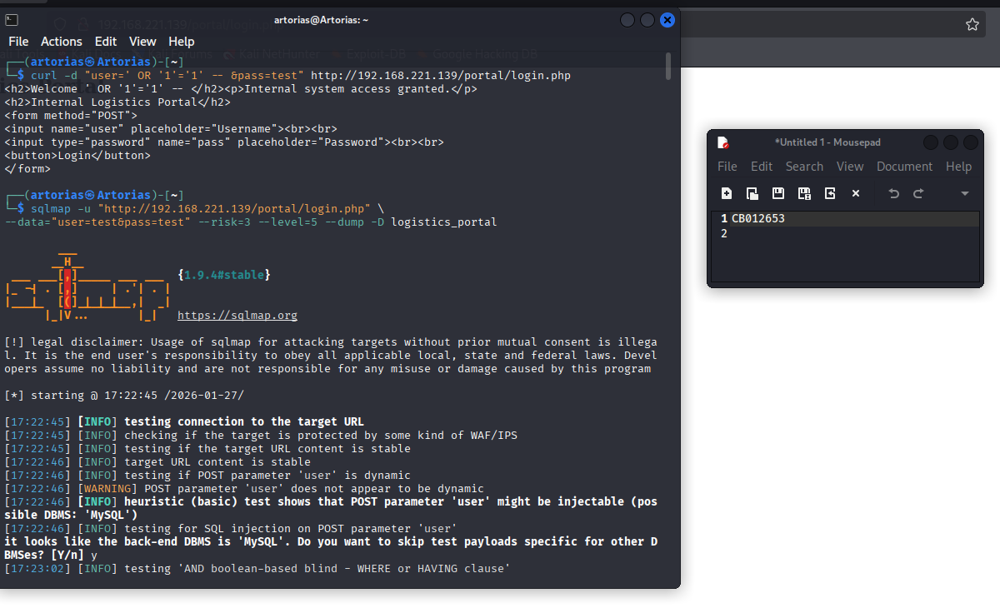
Figure 2.2: Manual verification of the SQL injection vulnerability.

Step 2: Automated Exploitation (Data Exfiltration)

To retrieve the hidden data, I used sqlmap with high risk and level settings to fully dump the logistics_portal database.

Command:

sqlmap -u "http://192.168.221.139/portal/login.php" --data="user=test&pass=test" --risk=3 --level=5 --dump -D logistics_portal

Result: The tool successfully extracted the incident_reports table, revealing FLAG{PHASE1_SQLI_INTERNAL_BREACH}.

Evidence:

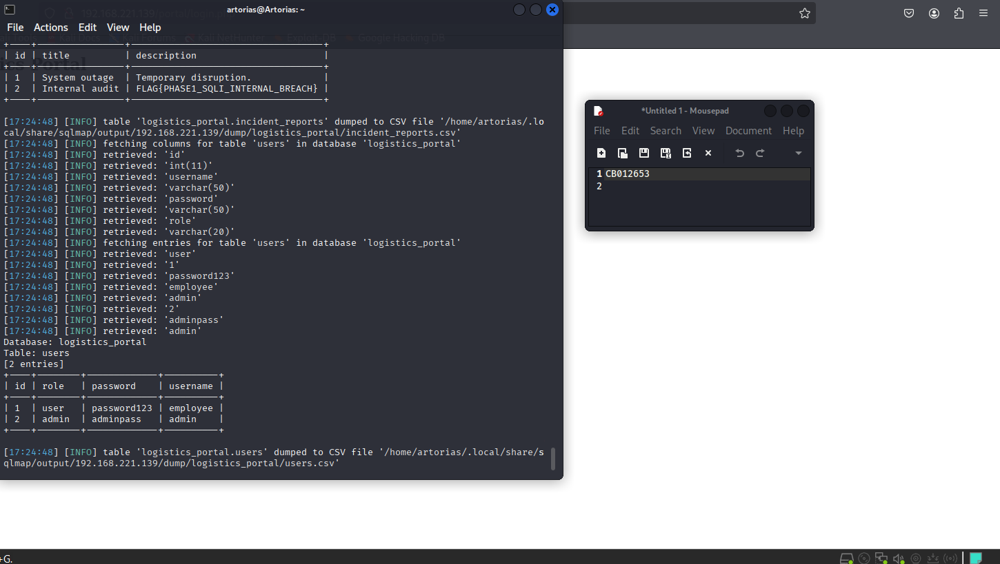
Figure 2.3: Sqlmap dumps the database and reveals the hidden flag.

Exploitation 2: Stored XSS (Hard)

Vulnerability: The "Incident Description" field in the reporting system does not sanitize input.

Step 1: Payload Injection

I identified that the admin page contains a hidden element with the ID admintoken. I injected a JavaScript payload designed to read this token and display it in an alert box.

Payload:

HTML

Evidence:

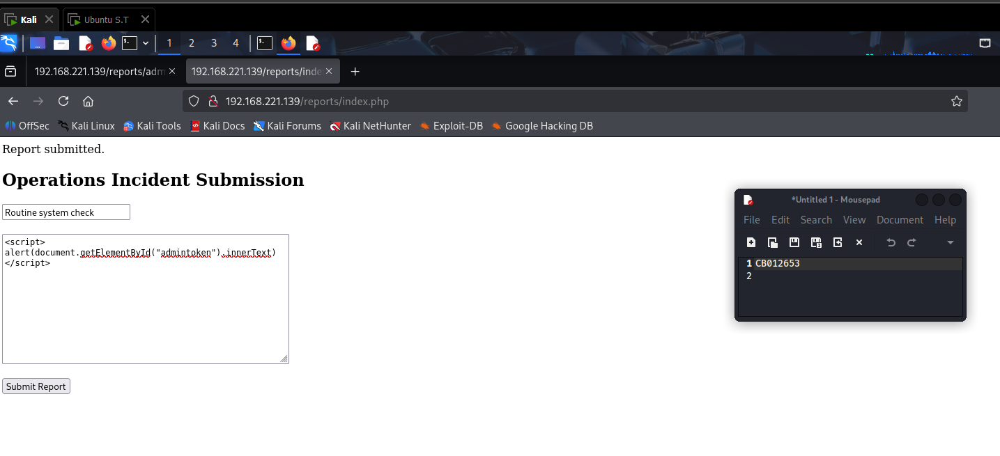
Figure 2.4: Injecting the malicious script into the incident report.

Step 2: Execution

I navigated to the admin dashboard (/reports/admin.php). The stored script executed immediately, stealing the hidden token.

URL: http://192.168.221.139/reports/admin.php

Evidence:

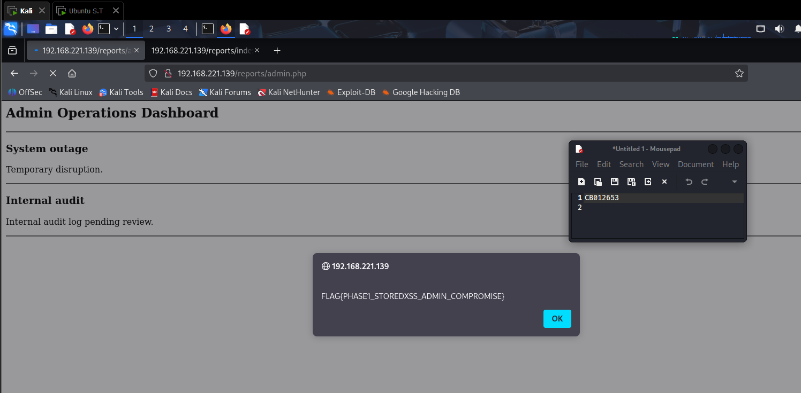
Figure 2.5: The Stored XSS executes on the admin page, revealing the flag.

## Phase 2 – Cryptography

Scenario

In Phase 2, the attacker discovers an exposed internal backup service running on port 8080. This service hosts sensitive cryptographic materials, including a credential backup file containing a weakly hashed password and an encrypted vault file. The objective of this phase is to demonstrate how poor cryptographic practices, such as weak hashing algorithms and improper key management, can lead to full compromise of protected data.

This phase contains two challenges:

• A Medium challenge, focusing on weak hash exposure and password cracking.• A Hard challenge, focusing on decrypting a protected vault to recover a hidden flag.

Exploitation 1: Cracking the Medium Challenge

Step 1: Creating the Cryptography Challenge Environment (Target VM)

On the Ubuntu server, a dedicated directory was created to store the cryptography challenge files. This directory simulates a sensitive internal backup location.

Command:

sudo mkdir -p /opt/phase2_crypto

sudo chown -R root:root /opt/phase2_crypto

sudo chmod 755 /opt/phase2_crypto

Evidence:

This ensures the environment is properly structured and permissions are set before placing sensitive files.

Step 2: Generating a Weak MD5 Hash

A weak password (winter2024) was chosen and hashed using MD5 to simulate poor credential storage practices.

Command:

echo -n "winter2024" | md5sum

Evidence:

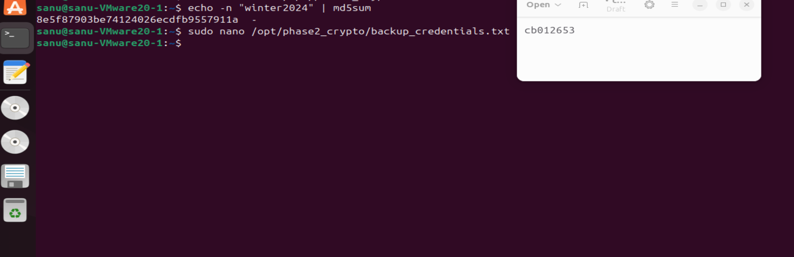
The generated hash will later be exposed to the attacker.

Step 3: Creating the Backup Credentials File

A file named backup_credentials.txt was created to store system details and the MD5 password hash.

Command:

sudo nano /opt/phase2_crypto/backup_credentials.txt

Contents included system information, hashing algorithm, and the MD5 password hash.

Evidence:

This file simulates a leaked internal credential export.

Step 4: Creating the Medium Challenge Vault

A plaintext vault file was created containing the first Phase 2 flag.

Command:

sudo nano /opt/phase2_crypto/secure_vault.txt

Flag stored:

FLAG{PHASE2_WEAK_HASH_CRACKED}

Evidence:

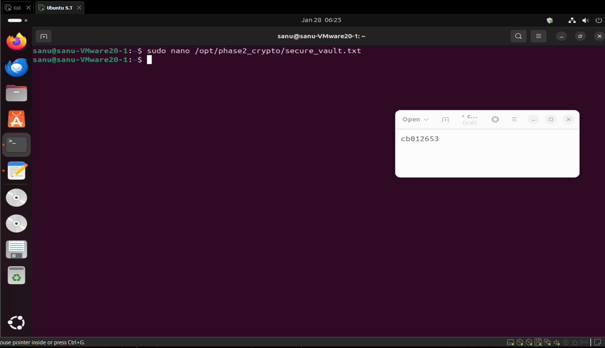

This represents sensitive data intended to be protected by encryption.

Step 5: Encrypting the Vault

The plaintext vault was encrypted using AES-256-CBC with the same weak password.

Command:

sudo openssl enc -aes-256-cbc -salt -in /opt/phase2_crypto/secure_vault.txt -out /opt/phase2_crypto/secure_vault.enc

Evidence:

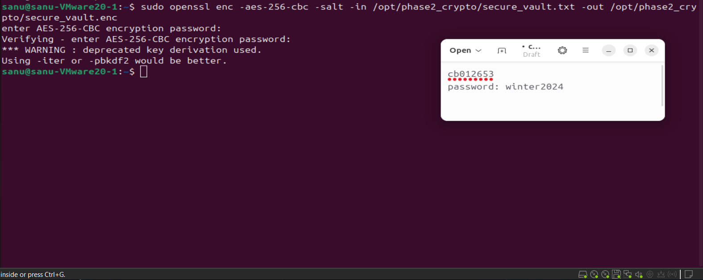
Step 6: Removing the Plaintext Vault

To simulate realistic secure storage, the original plaintext vault was deleted.

Command:

sudo rm /opt/phase2_crypto/secure_vault.txt

Evidence:

Step 7: Verifying the Hosted Files

The directory contents were listed to confirm only the encrypted vault and credential backup remained.

Command:

ls -l /opt/phase2_crypto

Evidence:

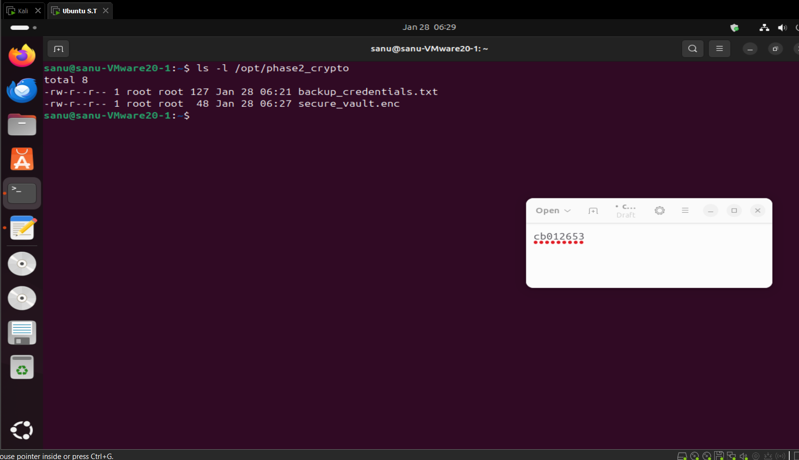
Step 8: Exposing the Backup Service

A Python HTTP server was started to expose the directory on port 8080.

Command:

cd /opt/phase2_crypto

sudo python3 -m http.server 8080

Evidence:

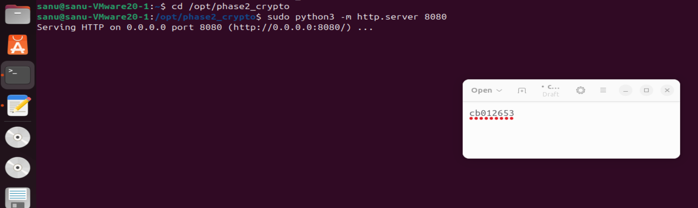
This simulates a misconfigured internal backup service.

Attacker Phase – Kali Linux

Step 9: Downloading the Exposed Files

From the Kali machine, the attacker downloads both exposed files.

Commands:

wget http://192.168.221.139:8080/backup_credentials.txt

wget http://192.168.221.139:8080/secure_vault.enc

Evidence:

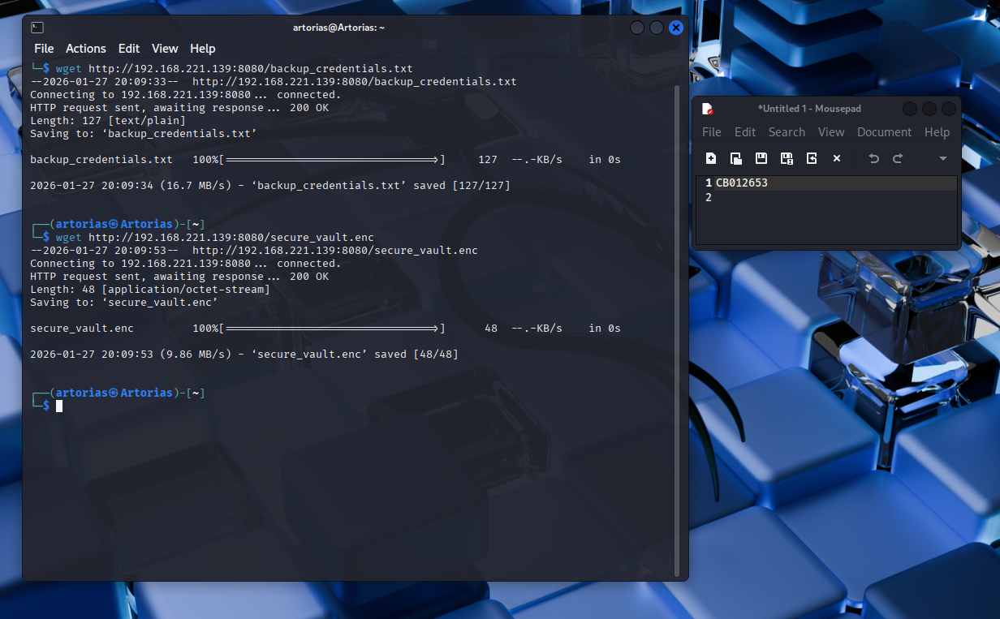
Step 10: Inspecting the Credential Backup

The contents of the backup file are displayed, revealing the MD5 password hash.

Command:

cat backup_credentials.txt

Evidence:

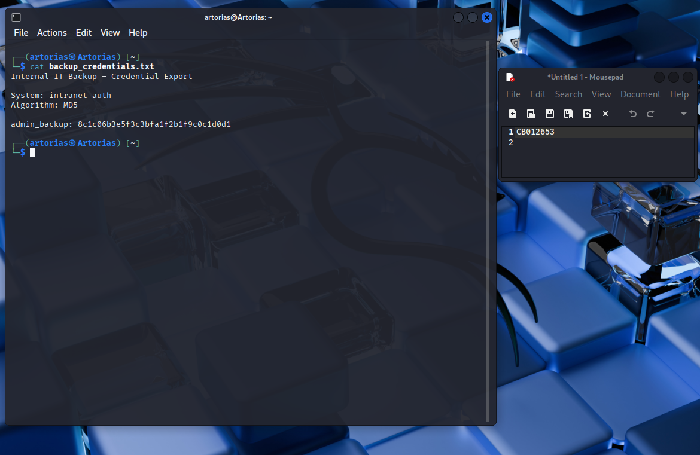
This confirms the use of a weak hashing algorithm.

Step 11: Preparing the Hash for Cracking

The extracted hash was placed into a file for cracking.

Command:

nano hash.txt

Evidence:

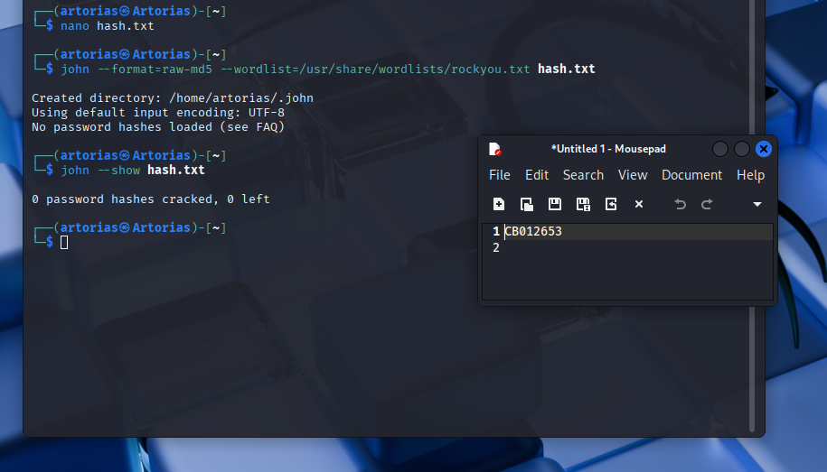
Step 12: Attempting Password Cracking

John the Ripper was used with the RockYou wordlist to crack the MD5 hash.

Command:

john --format=raw-md5 --wordlist=/usr/share/wordlists/rockyou.txt hash.txt

Evidence:

The password winter2024 was recovered.

Step 13: Decrypting the Medium Challenge Vault

The recovered password was used to decrypt the encrypted vault.

Command:

openssl enc -aes-256-cbc -d -in secure_vault.enc -out decrypted.txt

Evidence:

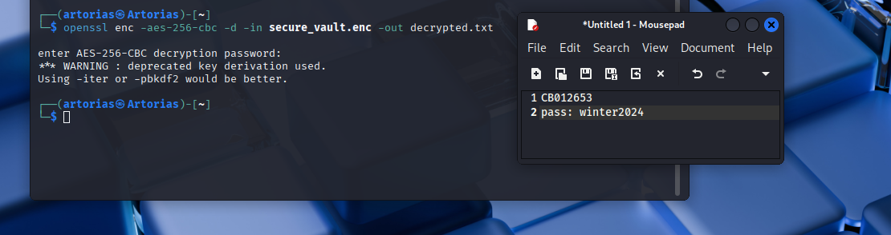
Step 14: Extracting the Medium Flag

The decrypted file was displayed.

Command:

cat decrypted.txt

Evidence:

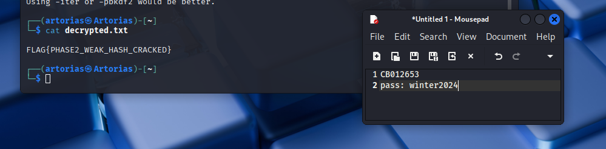
This completes the Medium challenge.

Exploitation 2: Hard Challenge – Encrypted Vault Compromise

Step 15: Creating the Hard Challenge Vault (Target VM)

A second vault file was created containing the hard challenge flag.

Command:

sudo nano /opt/phase2_crypto/vault_secret.txt

Flag stored:

FLAG{PHASE2_ENCRYPTED_VAULT_DECRYPTED}

Evidence:

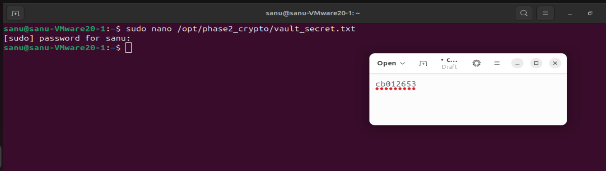
Step 16: Encrypting the Hard Vault

The vault was encrypted using AES-256-CBC.

Command:

sudo openssl enc -aes-256-cbc -salt -in /opt/phase2_crypto/vault_secret.txt -out /opt/phase2_crypto/secure_vault.enc

Evidence:

Step 17: Removing the Plaintext Hard Vault

Command:

sudo rm /opt/phase2_crypto/vault_secret.txt

Evidence:

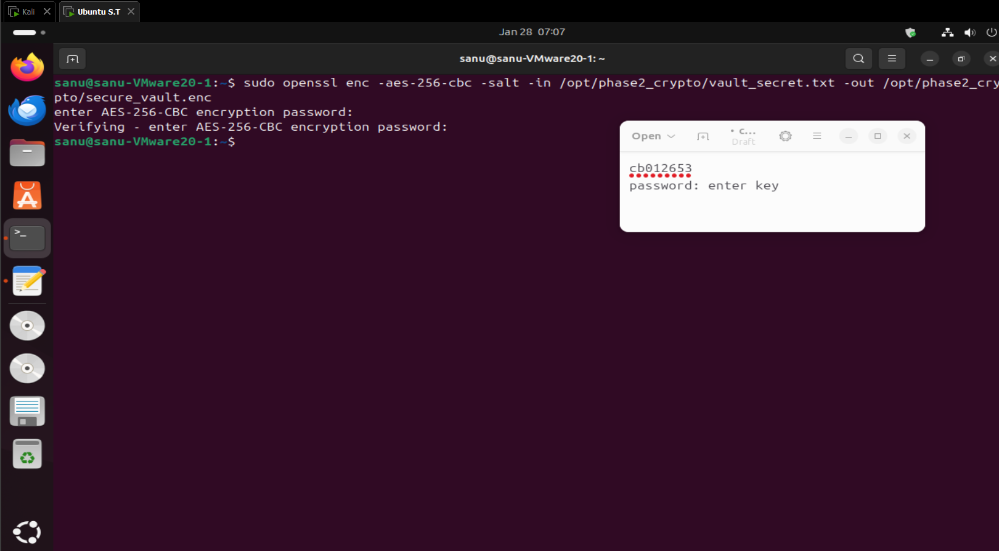
Step 18: Decrypting the Hard Challenge Vault (Kali)

The attacker again decrypts the vault using the recovered encryption password.

Command:

openssl enc -aes-256-cbc -d -in secure_vault.enc -out phase2_flag.txt

Evidence:

Step 19: Extracting the Hard Flag

Command:

cat phase2_flag.txt

Evidence:

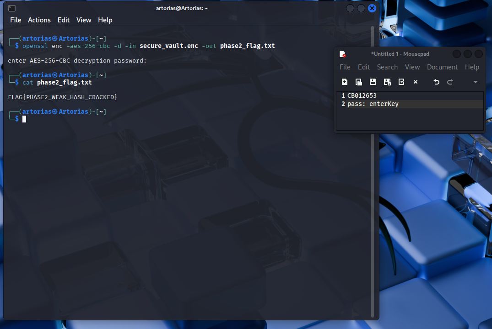
## Phase 3 – Privilege Escalation

Scenario Overview

In this phase, the attacker starts with access to a low-privileged local user account (employee) on the Ubuntu VM. The objective is to escalate privileges to the root user by exploiting sudo misconfiguration (medium challenge) and an insecure SUID binary (hard challenge).

Part A – Environment Setup (Ubuntu VM)

Creating a Low-Privilege User

A new low-privileged user named employee was created to simulate a standard internal employee account.

Command(s):

sudo useradd -m -s /bin/bash employee

sudo passwd employee

Evidence:

Creating the Medium Difficulty Flag

A flag file for the medium challenge was created inside the /root directory, ensuring it is only accessible with elevated privileges.

Command:

sudo nano /root/phase3_medium_flag.txt

Flag Content:

FLAG{PHASE3_SUDO_MISCONFIG_ROOT}

Evidence:

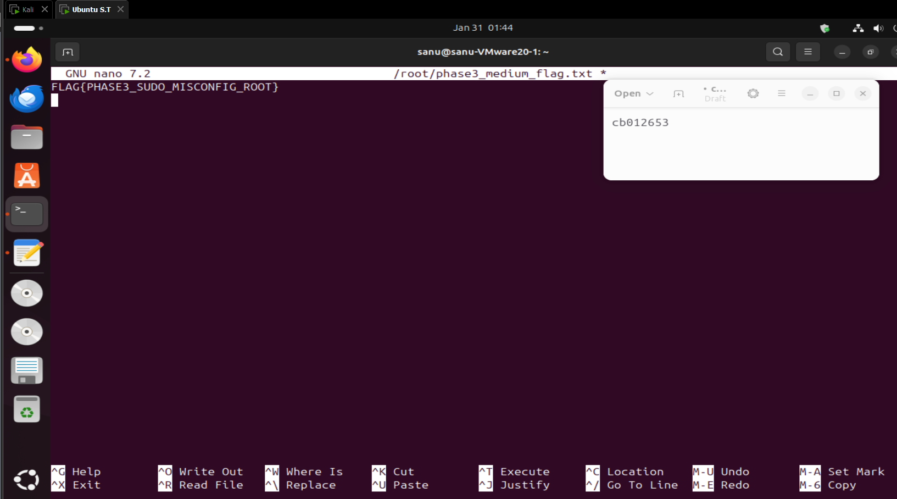
Securing the Medium Flag

Permissions on the medium flag file were restricted so that only the root user can read or modify it.

Command:

sudo chmod 600 /root/phase3_medium_flag.txt

Evidence:

Configuring the Sudo Misconfiguration

The sudoers file was edited to introduce a deliberate misconfiguration. The employee user was allowed to run the find binary with root privileges without a password.

Command:

sudo nano /etc/sudoers

Added Line:

employee ALL=(ALL) NOPASSWD: /usr/bin/find

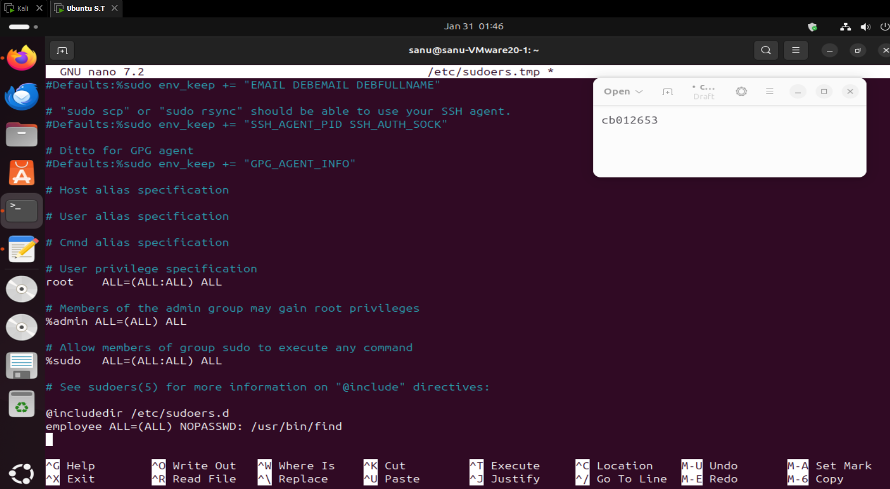
Evidence:

Creating the SUID Backup Script

A script was created in /usr/local/bin that spawns a privileged shell. This script is intended for the hard challenge.

Command:

sudo nano /usr/local/bin/backup.sh

Script Content:

/bin/bash -p

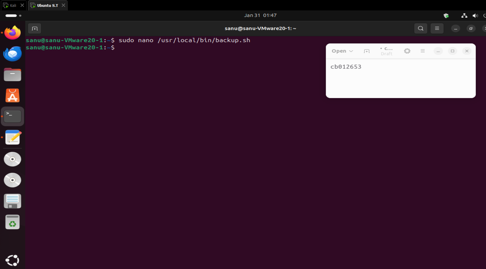
Evidence:

Assigning SUID Permissions to the Script

The script was made executable and assigned the SUID bit, causing it to execute with root privileges regardless of the calling user.

Command(s):

sudo chmod +x /usr/local/bin/backup.sh

sudo chmod u+s /usr/local/bin/backup.sh

ls -l /usr/local/bin/backup.sh

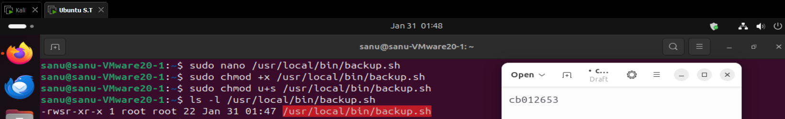
Evidence:

Creating the Hard Difficulty Flag

A second flag was created for the hard challenge, also stored inside the root directory.

Command:

sudo nano /root/phase3_hard_flag.txt

Flag Content:

FLAG{PHASE3_SUID_BINARY_ESCALATION}

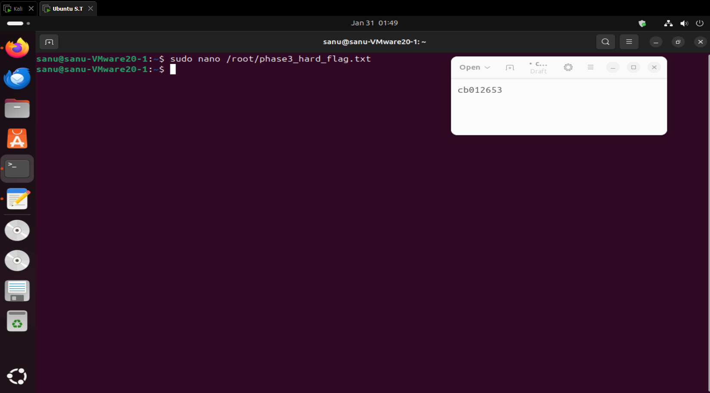
Evidence:

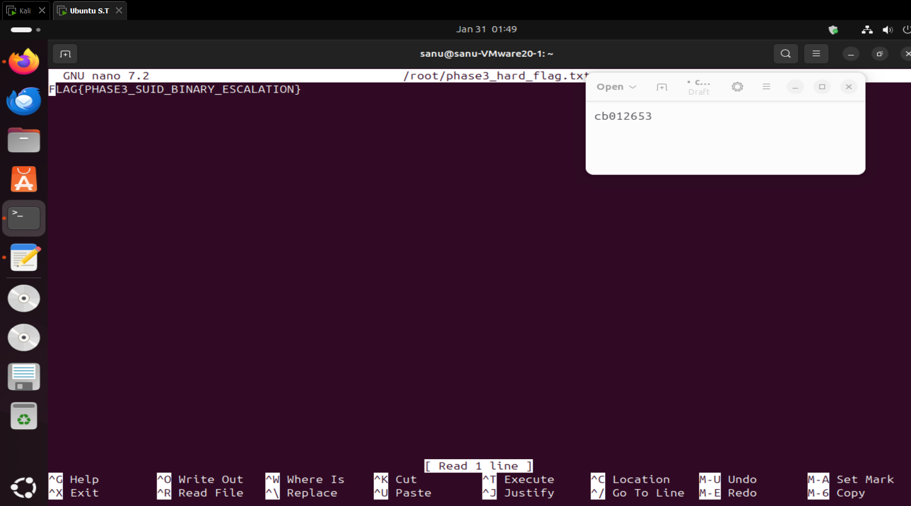
Securing the Hard Flag

The hard flag file was locked down so that only root can access it.

Command:

sudo chmod 600 /root/phase3_hard_flag.txt

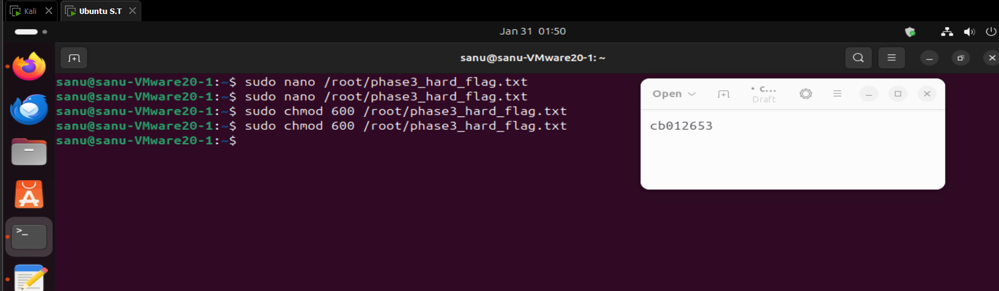
Evidence:

Part B – Exploitation Phase (Attacker Perspective)

Switching to the Employee User

The attacker switched from the administrative user to the low-privileged employee account.

Command(s):

su - employee

whoami

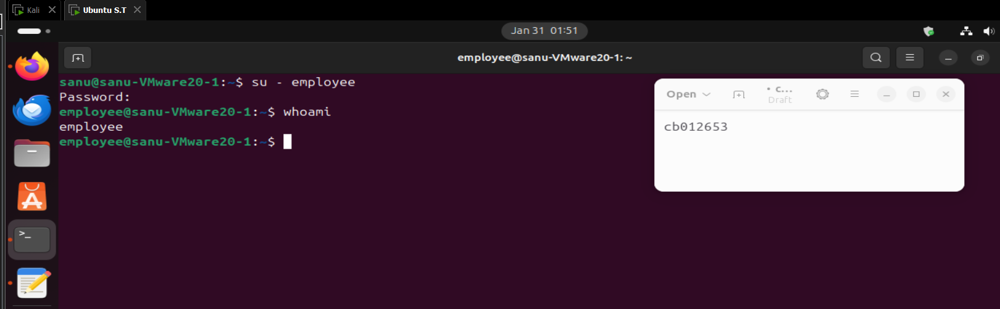
Evidence:

Enumerating Sudo Privileges

The attacker enumerated available sudo permissions for the employee account.

Command:

sudo -l

Result:The output confirmed that employee can execute /usr/bin/find as root without a password.

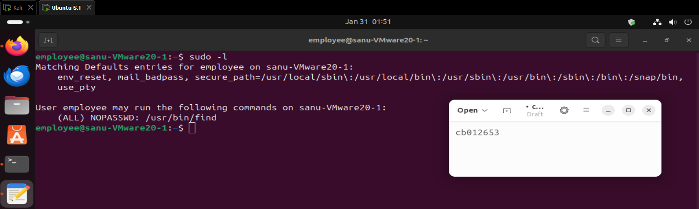
Evidence:

Exploiting Sudo Find to Gain Root Shell

The find binary was abused to spawn a root shell using the -exec option.

Command(s):

sudo find . -exec /bin/bash \; -quit

whoami

Result:The attacker successfully escalated privileges to root.

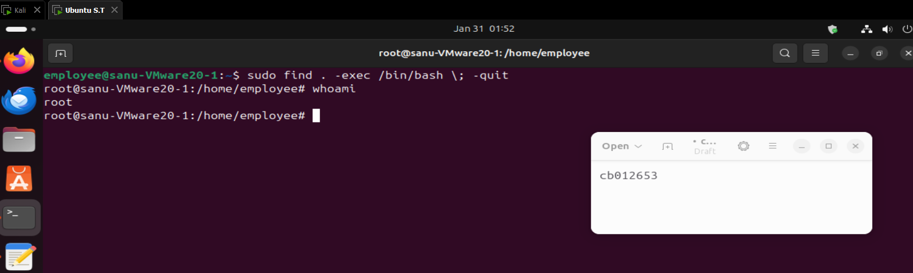
Evidence:

Capturing the Medium Flag

With root access obtained, the medium difficulty flag was retrieved.

Command:

cat /root/phase3_medium_flag.txt

Output:

FLAG{PHASE3_SUDO_MISCONFIG_ROOT}

Evidence:

Enumerating SUID Binaries

The attacker searched the system for files with the SUID permission bit set.

Command:

find / -perm -4000 2>/dev/null

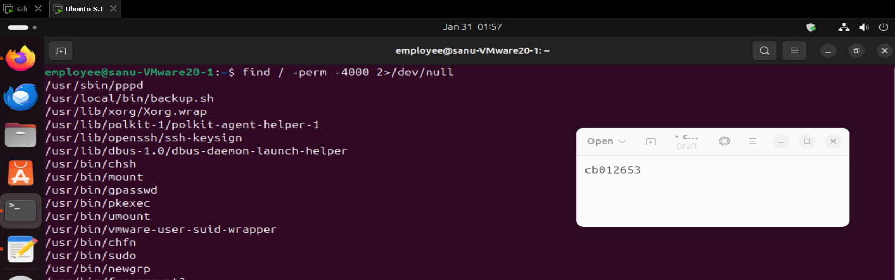
Evidence:

Identifying the Vulnerable SUID Script

The presence of /usr/local/bin/backup.sh in the SUID list confirmed a potential privilege escalation vector.

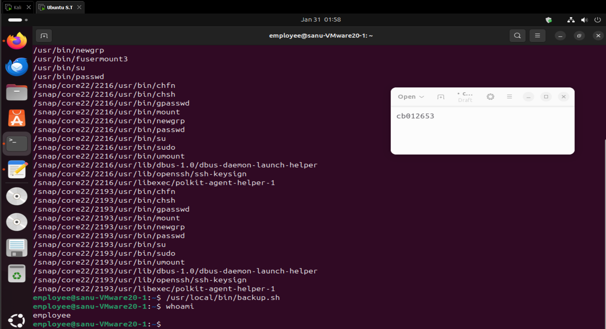
Evidence:

Exploiting the SUID Binary

The SUID script was executed directly, spawning a root shell.

Command(s):

/usr/local/bin/backup.sh

whoami

Result:The attacker obtained root privileges again via SUID exploitation.

Evidence:

Capturing the Hard Flag

With root access via the SUID binary, the hard challenge flag was retrieved.

Command:

cat /root/phase3_hard_flag.txt

Output:

FLAG{PHASE3_SUID_BINARY_ESCALATION}

Evidence:

Phase 3 Summary

Medium Challenge: Exploited a sudo misconfiguration allowing passwordless execution of find, resulting in full root compromise.

Hard Challenge: Abused a custom SUID binary executing /bin/bash -p to escalate privileges.

Both vulnerabilities demonstrate real-world privilege escalation risks caused by improper sudo rules and unsafe SUID binaries.

## Phase 4: Network Exploitation

Step 1: Target Network Configuration Verification

I executed the ip a command on the target machine to confirm its network interface configuration and reachability. The output identifies the target's IP address as 192.168.221.138, which serves as the destination for the subsequent network attacks.

Command: ip a

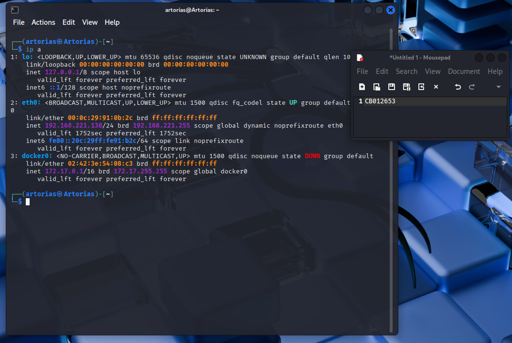
Evidence:

Step 2: Attacker Network Configuration Verification

I checked the attacker machine's network settings using ip a to ensure it was correctly configured on the same subnet as the target. The configuration confirms the attacker is operating from IP 192.168.221.139, allowing for direct communication with the target.

Command: ip a

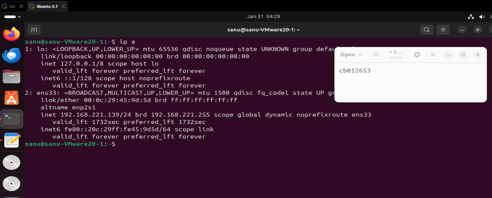
Evidence:

Step 3: Network Service Enumeration

I performed a service scan against the target using nmap to identify running applications and open ports. The scan results revealed open ports including port 80 (HTTP) and port 9876, providing the initial entry points for exploitation.

Command: nmap -sC -sV 192.168.221.138

Evidence:

Step 4: Creating the Network Enumeration Flag

I created the first flag file for Phase 4 using the nano editor to simulate a sensitive asset found during reconnaissance. I entered the content FLAG{PHASE4_NETWORK_ENUMERATION} to serve as the proof of successful enumeration.

Command: sudo nano /root/phase4_medium_flag.txt

Evidence:

Step 5: Securing the Enumeration Flag

I restricted access to the enumeration flag using chmod to ensure only privileged users could access it. This simulates a secured file that requires root privileges or specific exploits to read.

Command: sudo chmod 600 /root/phase4_medium_flag.txt

Evidence:

Step 6: Installing the Vulnerable FTP Service

I installed the vsftpd server to set up the "Hard" challenge for this phase. This service is intended to be misconfigured to allow unauthorized access, mimicking a common vulnerability in legacy systems.

Command: sudo apt install vsftpd

Evidence:

Step 7: Configuring Anonymous FTP Access

I edited the configuration file /etc/vsftpd.conf to enable anonymous login. By setting anonymous_enable=YES, I created a deliberate security hole allowing unauthenticated users to access the FTP share.

Command: sudo nano /etc/vsftpd.conf

Evidence:

Step 8: Restarting the FTP Service

I applied the configuration changes by restarting the vsftpd service. This ensures the FTP server is active and listening with the insecure anonymous login setting enabled.

Command: sudo systemctl restart vsftpd

Evidence:

Step 9: Creating the FTP Flag

I created the hard challenge flag located in the FTP directory to be the target of the exploitation. The content FLAG{PHASE4_ANON_FTP_PWNED} is placed here to be accessible to anyone who exploits the anonymous login.

Command: sudo nano /srv/ftp/phase4_hard_flag.txt

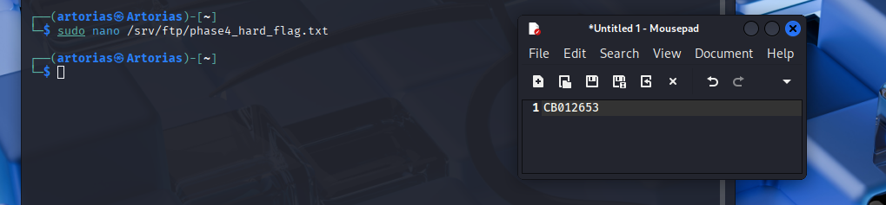
Evidence:

Step 10: Establishing FTP Connection

From the attacker machine, I initiated a connection to the target using the ftp command. This step verifies that the FTP service is reachable and responding to connection requests.

Command: ftp 192.168.221.138

Evidence:

Step 11: Exploiting Anonymous Login

I logged into the FTP server using the username anonymous and the password anonymous. The successful login confirms that the server is vulnerable to unauthenticated access.

Command: Name: anonymous / Password: anonymous

Evidence:

Step 12: Exfiltrating the FTP Flag

I retrieved the flag file using the get command within the FTP session. This completes the "Hard" network exploitation challenge by proving unauthorized data exfiltration.

Command: get phase4_hard_flag.txt

Evidence:

## Phase 5: Forensics

Step 13: Analyzing System Auth Logs

I inspected the system's authentication logs at /var/log/auth.log to trace the attacker's activity. This file contains records of user logins and privileged command executions, which are critical for forensic investigation.

Command: cat /var/log/auth.log

Evidence:

Step 14: Filtering for Sudo Activity

I filtered the authentication logs for the term "sudo" to highlight privileged operations. This command isolates specific instances where users attempted to elevate privileges, helping to identify the time and nature of the breach.

Command: grep "sudo" /var/log/auth.log

Evidence:

Step 15: Creating the Log Analysis Flag

I created the forensic medium flag phase5_medium_flag.txt to reward the successful identification of suspicious log entries. The content FLAG{PHASE5_AUTH_LOG_ANALYSIS} serves as proof of the investigation.

Command: sudo nano /root/phase5_medium_flag.txt

Evidence:

Step 16: Securing the Log Analysis Flag

I applied strict permissions to the forensic flag to ensure it remains a protected evidence file. Setting the mode to 600 ensures only the root user can access it, maintaining the integrity of the challenge.

Command: sudo chmod 600 /root/phase5_medium_flag.txt

Evidence:

Step 17: Investigating User History

I examined the command history for the employee user using .bash_history. This file reveals the specific commands previously executed by the user, providing critical context on their actions leading up to the compromise.

Command: cat /home/employee/.bash_history

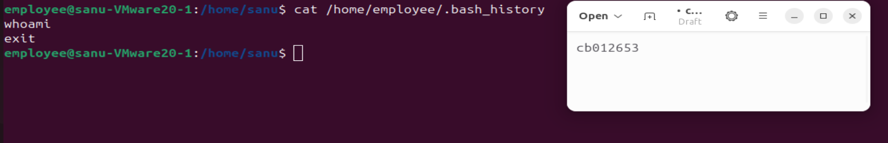
Evidence:

Step 18: Listing User Directory Contents

I performed a detailed directory listing of the user's home folder to check for artifacts. The ls -la command reveals hidden files and permissions, helping to identify any dropped payloads or anomalies.

Command: ls -la /home/employee

Evidence:

Step 19: Recovering the Final Forensic Flag

I escalated privileges to the root user to access the final restricted evidence file. This step simulates the investigator gaining full control to recover protected forensic data.

Command: sudo -i

Evidence:

Step 20: Capturing the Final Flag

I read the content of the final hard flag phase5_hard_flag.txt to complete the forensics phase. The flag FLAG{PHASE5_FORENSIC_FILE_RECOVERY} confirms the successful recovery of the hidden evidence.

Command: cat /root/phase5_hard_flag.txt

Evidence:

# 3. Risk & Threat Analysis

Vulnerability

Risk Level

Business Impact

Weak Hashing (MD5)

High

MD5 is cryptographically broken. Attackers can crack passwords in seconds, leading to unauthorized access.

Sudo Misconfig (find)

Critical

Allows any compromised low-level user to instantly gain Root (Administrative) control, compromising the entire server.

SUID Binaries

Critical

Custom SUID scripts are often unaudited. Exploitation grants root access, bypassing all standard authentication controls.

Anonymous FTP

Medium

Unauthenticated access can lead to sensitive data leakage (like the flag) or allow attackers to upload malware.

Cleartext Logs

Low

While not a vulnerability itself, the failure to forward logs to a SIEM means attacks might go unnoticed until it is too late.

# 4. Incident Response & Recovery

To mitigate these vulnerabilities and recover from such an exploitation, the following strategies are proposed:

Patching Cryptography: Deprecate MD5. Implement strong hashing algorithms like bcrypt or Argon2 for password storage.

Least Privilege (Sudo): Audit /etc/sudoers. Never grant NOPASSWD access to binaries that allow shell escapes (like find, vim, awk, tar). Use restricted sudo profiles.

Hardening Binaries: Remove the SUID bit from custom scripts. If administrative privileges are needed, use sudo with specific arguments rather than generic SUID permissions.

Network Hardening: Disable Anonymous FTP in /etc/vsftpd.conf (anonymous_enable=NO). Use SFTP (SSH File Transfer) instead of unencrypted FTP.

Forensic Readiness: Enable centralized logging (sending logs to a remote server) so that if a machine is wiped, the evidence remains preserved.

# 5. Critical Reflection

Developing this CTF box highlighted the delicate balance between functionality and security. One of the primary challenges faced was ensuring the "Hard" challenges were exploitable but logical; for instance, ensuring the SUID script worked reliably for the attacker.

Ethically, this project underscored the responsibility of system administrators. The vulnerabilities included (like the sudo find exploit) are not theoretical bugs but common misconfigurations found in real enterprise environments. Learning to exploit them has significantly improved my ability to audit systems defensively. I now understand that a single weak link like a reuse of a password found in a "hidden" text file can break the entire security chain, escalating an attacker from a web visitor to Root access.
