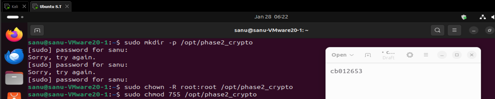
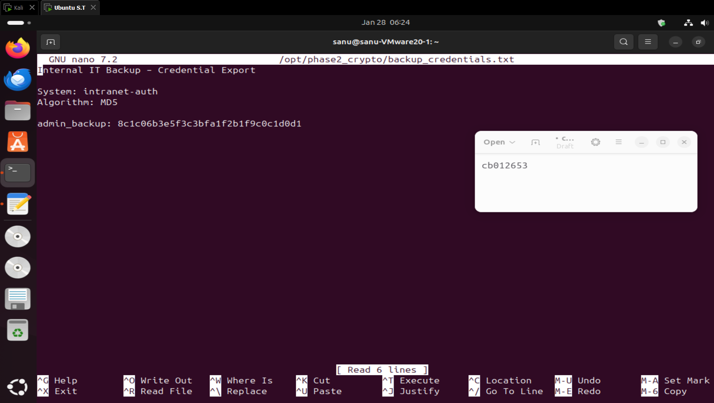
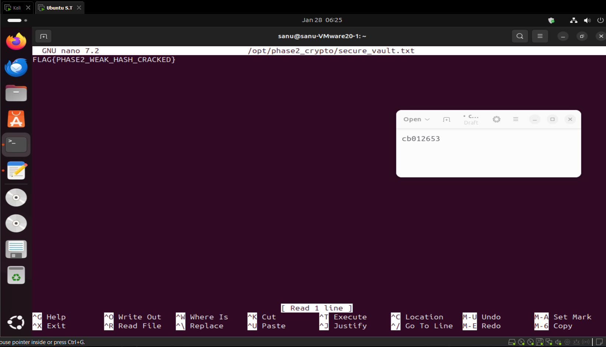
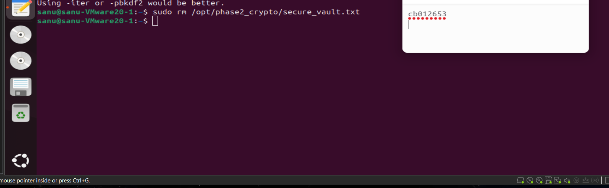
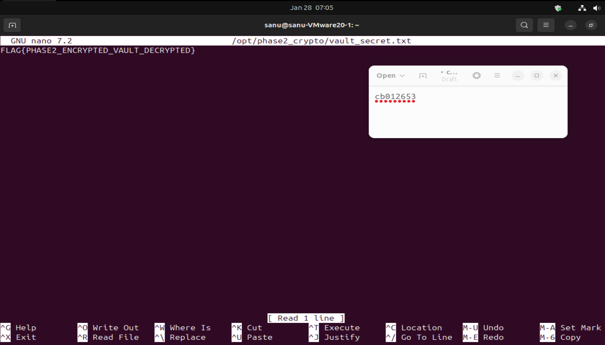
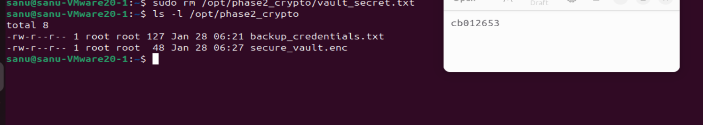
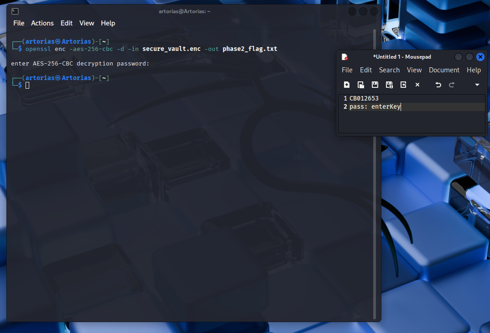

# Phase 2: Cryptography

Cryptography challenges from the same lab exercise. Documented in screenshots - see the note below.

---

<!-- source: Phase 2 ss.docx -->

Attacker pov

Hard challenge

