# Phase 4 and 5: Network Exploitation and Forensics

Network-level exploitation against the lab box, then forensic examination of what the activity left behind.

---

<!-- source: Phase 4 & 5 done.docx -->

Phase 4: Network Exploitation

Step 1: Target Network Configuration Verification

I executed the ip a command on the target machine to confirm its network interface configuration and reachability. The output identifies the target's IP address as 192.168.221.138, which serves as the destination for the subsequent network attacks.

Command: ip a

Evidence:

Step 2: Attacker Network Configuration Verification

I checked the attacker machine's network settings using ip a to ensure it was correctly configured on the same subnet as the target. The configuration confirms the attacker is operating from IP 192.168.221.139, allowing for direct communication with the target.

Command: ip a

Evidence:

Step 3: Network Service Enumeration

I performed a service scan against the target using nmap to identify running applications and open ports. The scan results revealed open ports including port 80 (HTTP) and port 9876, providing the initial entry points for exploitation.

Command: nmap -sC -sV 192.168.221.138

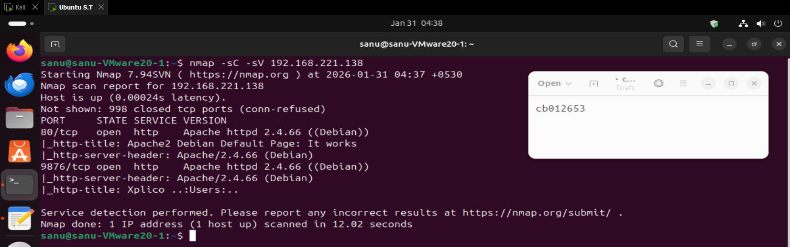
Evidence:

Step 4: Creating the Network Enumeration Flag

I created the first flag file for Phase 4 using the nano editor to simulate a sensitive asset found during reconnaissance. I entered the content FLAG{PHASE4_NETWORK_ENUMERATION} to serve as the proof of successful enumeration.

Command: sudo nano /root/phase4_medium_flag.txt

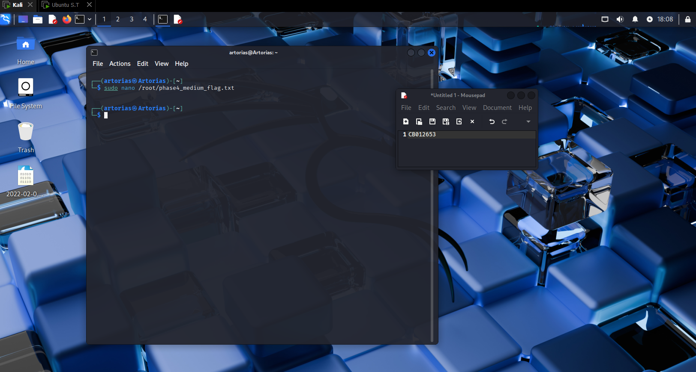
Evidence:

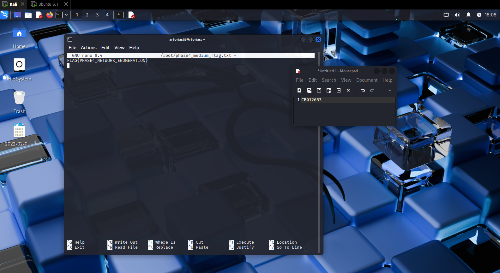
Step 5: Securing the Enumeration Flag

I restricted access to the enumeration flag using chmod to ensure only privileged users could access it. This simulates a secured file that requires root privileges or specific exploits to read.

Command: sudo chmod 600 /root/phase4_medium_flag.txt

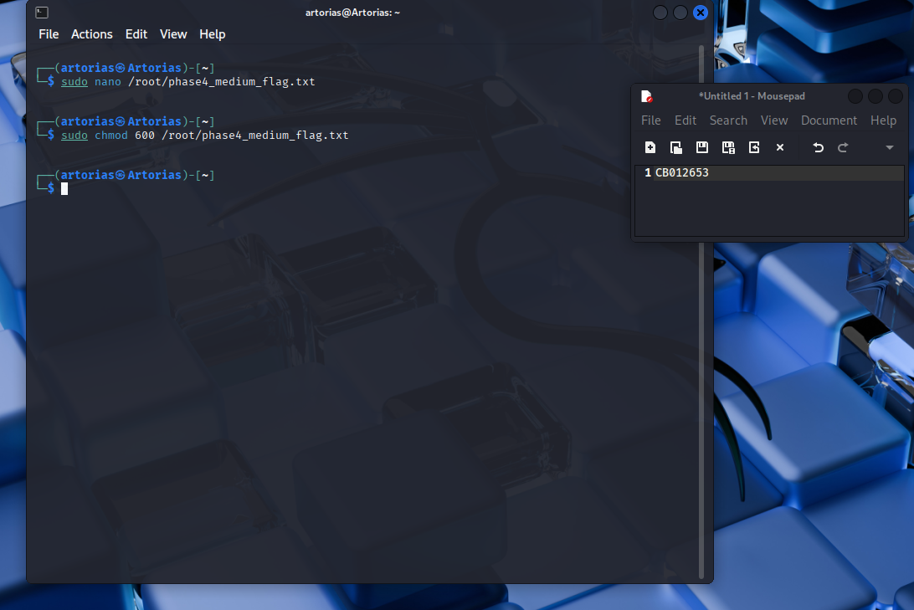
Evidence:

Step 6: Installing the Vulnerable FTP Service

I installed the vsftpd server to set up the "Hard" challenge for this phase. This service is intended to be misconfigured to allow unauthorized access, mimicking a common vulnerability in legacy systems.

Command: sudo apt install vsftpd

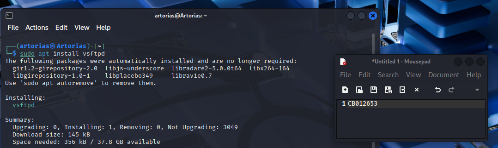
Evidence:

Step 7: Configuring Anonymous FTP Access

I edited the configuration file /etc/vsftpd.conf to enable anonymous login. By setting anonymous_enable=YES, I created a deliberate security hole allowing unauthenticated users to access the FTP share.

Command: sudo nano /etc/vsftpd.conf

Evidence:

Step 8: Restarting the FTP Service

I applied the configuration changes by restarting the vsftpd service. This ensures the FTP server is active and listening with the insecure anonymous login setting enabled.

Command: sudo systemctl restart vsftpd

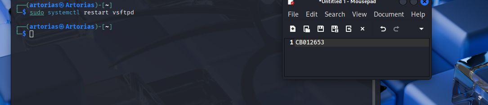
Evidence:

Step 9: Creating the FTP Flag

I created the hard challenge flag located in the FTP directory to be the target of the exploitation. The content FLAG{PHASE4_ANON_FTP_PWNED} is placed here to be accessible to anyone who exploits the anonymous login.

Command: sudo nano /srv/ftp/phase4_hard_flag.txt

Evidence:

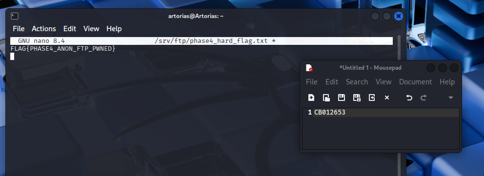
Step 10: Establishing FTP Connection

From the attacker machine, I initiated a connection to the target using the ftp command. This step verifies that the FTP service is reachable and responding to connection requests.

Command: ftp 192.168.221.138

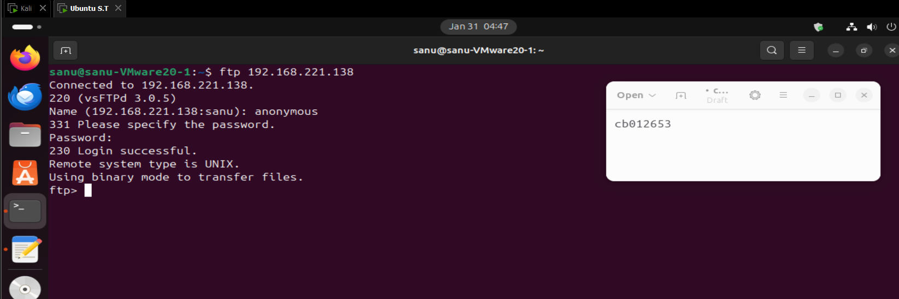
Evidence:

Step 11: Exploiting Anonymous Login

I logged into the FTP server using the username anonymous and the password anonymous. The successful login confirms that the server is vulnerable to unauthenticated access.

Command: Name: anonymous / Password: anonymous

Evidence:

Step 12: Exfiltrating the FTP Flag

I retrieved the flag file using the get command within the FTP session. This completes the "Hard" network exploitation challenge by proving unauthorized data exfiltration.

Command: get phase4_hard_flag.txt

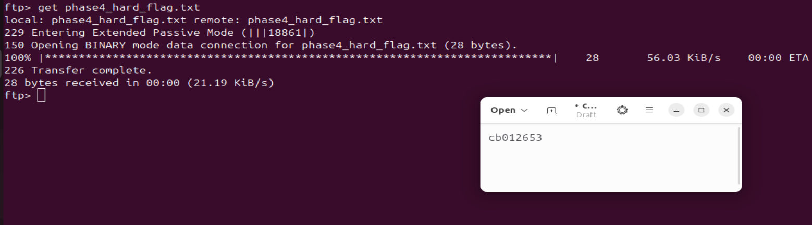
Evidence:

Phase 5: Forensics

Step 13: Analyzing System Auth Logs

I inspected the system's authentication logs at /var/log/auth.log to trace the attacker's activity. This file contains records of user logins and privileged command executions, which are critical for forensic investigation.

Command: cat /var/log/auth.log

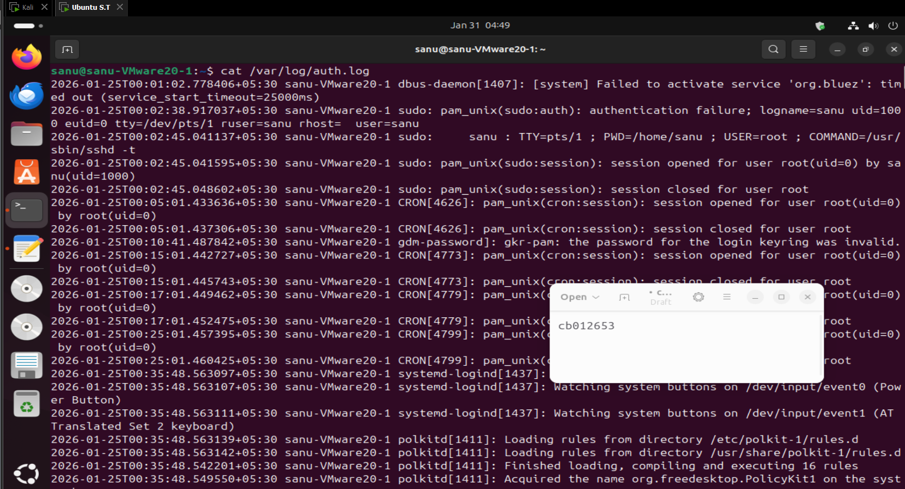
Evidence:

Step 14: Filtering for Sudo Activity

I filtered the authentication logs for the term "sudo" to highlight privileged operations. This command isolates specific instances where users attempted to elevate privileges, helping to identify the time and nature of the breach.

Command: grep "sudo" /var/log/auth.log

Evidence:

Step 15: Creating the Log Analysis Flag

I created the forensic medium flag phase5_medium_flag.txt to reward the successful identification of suspicious log entries. The content FLAG{PHASE5_AUTH_LOG_ANALYSIS} serves as proof of the investigation.

Command: sudo nano /root/phase5_medium_flag.txt

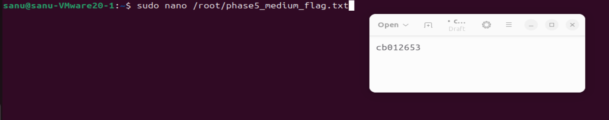
Evidence:

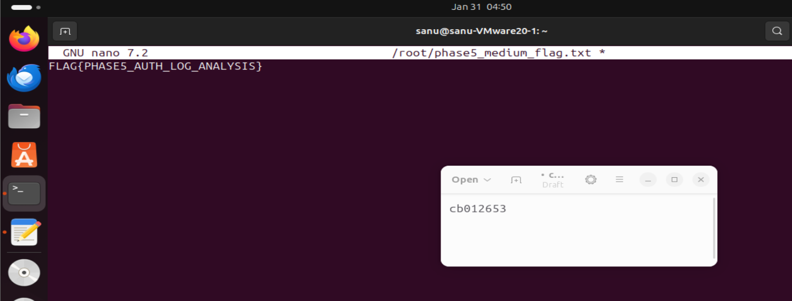
Step 16: Securing the Log Analysis Flag

I applied strict permissions to the forensic flag to ensure it remains a protected evidence file. Setting the mode to 600 ensures only the root user can access it, maintaining the integrity of the challenge.

Command: sudo chmod 600 /root/phase5_medium_flag.txt

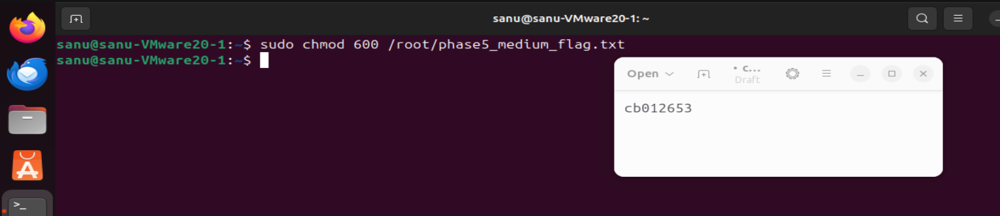
Evidence:

Step 17: Investigating User History

I examined the command history for the employee user using .bash_history. This file reveals the specific commands previously executed by the user, providing critical context on their actions leading up to the compromise.

Command: cat /home/employee/.bash_history

Evidence:

Step 18: Listing User Directory Contents

I performed a detailed directory listing of the user's home folder to check for artifacts. The ls -la command reveals hidden files and permissions, helping to identify any dropped payloads or anomalies.

Command: ls -la /home/employee

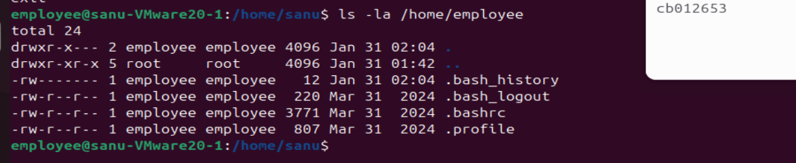
Evidence:

Step 19: Recovering the Final Forensic Flag

I escalated privileges to the root user to access the final restricted evidence file. This step simulates the investigator gaining full control to recover protected forensic data.

Command: sudo -i

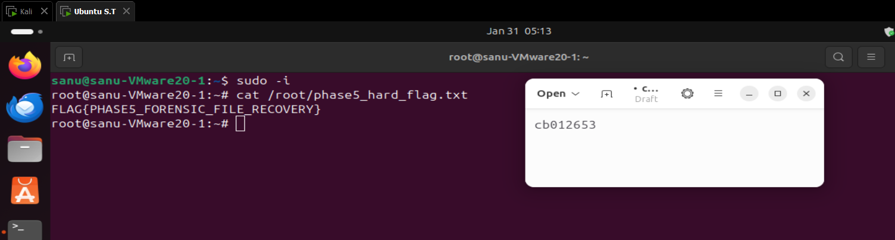
Evidence:

Step 20: Capturing the Final Flag

I read the content of the final hard flag phase5_hard_flag.txt to complete the forensics phase. The flag FLAG{PHASE5_FORENSIC_FILE_RECOVERY} confirms the successful recovery of the hidden evidence.

Command: cat /root/phase5_hard_flag.txt

Evidence:
